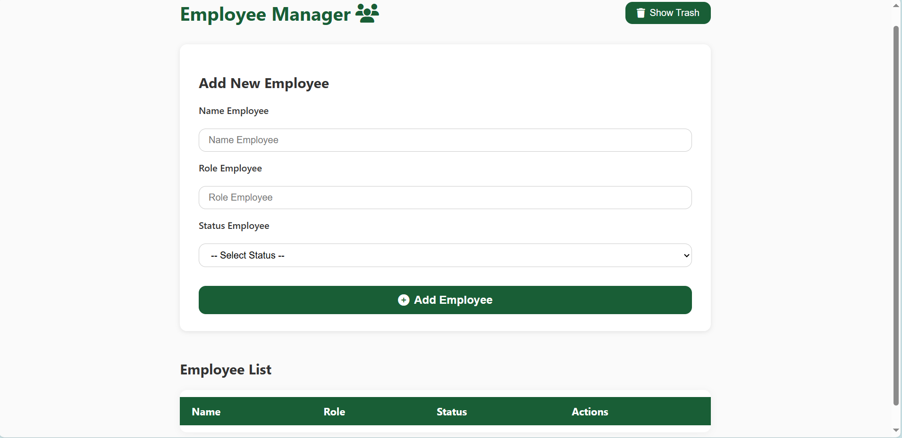
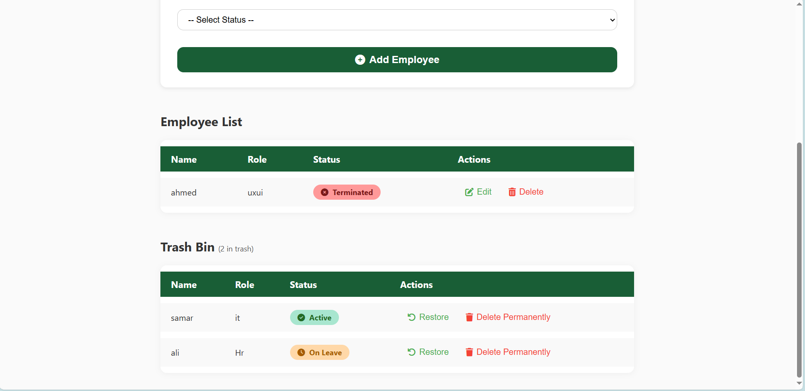
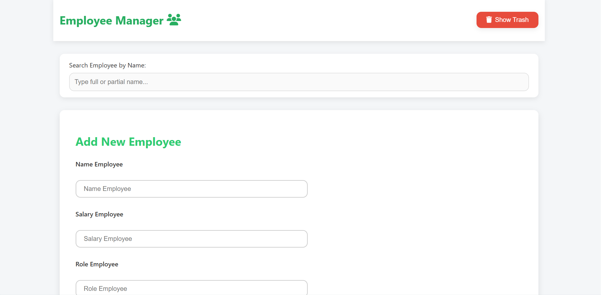
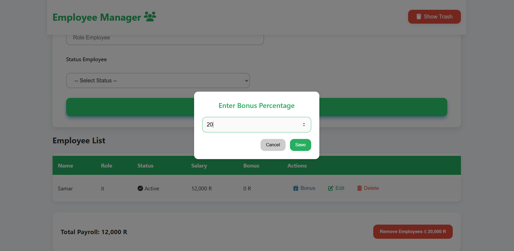
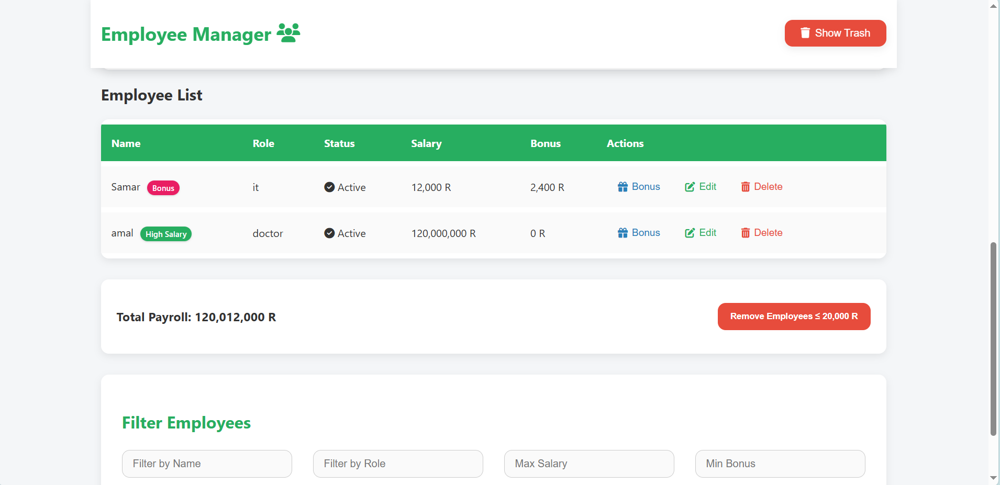

# Employee Management System

A modern, **responsive** and **user-friendly** dashboard to manage employee records, built with **HTML, CSS, and JavaScript**.

This project provides an easy way to manage employees with an elegant UI, real-time filtering, field validation, and interactive modals.

---

## Features

- **Add, Edit, and Delete Employees** with live validation (name, role, salary, and status).
- **Filter Employees** by name, role, salary range, bonus range, and status.
- **Search Bar** with instant results.
- **Employee Status Management**: Active, On Leave, Terminated (with icons).
- **Trash Bin** to temporarily store deleted employees (restore or permanently delete).
- **Badges**:
  - Green badge for **high salary employees (≥ 100,000 R)**.
  - Pink badge for employees with **bonus**.
- **Bonus Modal**:
  - Add bonus by percentage with live validation (0–100%).
- **Payroll Summary** showing total payroll dynamically.
- **Responsive Layout** using **CSS Grid & Flexbox** (works on mobile, tablet, and desktop).
- **UX/UI Enhancements**:
  - Smooth hover effects.
  - Pastel and professional color scheme.
  - Accessible form elements and buttons.

---

 Preview

 Dashboard UI:

---

## Technologies Used

- **HTML5**
- **CSS3**
  - CSS Variables for theme colors.
  - Grid and Flexbox for layout.
  - Pastel dashboard design.
- **JavaScript**
  - DOM Manipulation.
  - Form validation (regex-based).
  - Event listeners for filters and CRUD operations.
